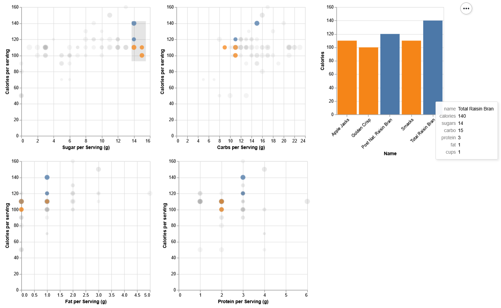
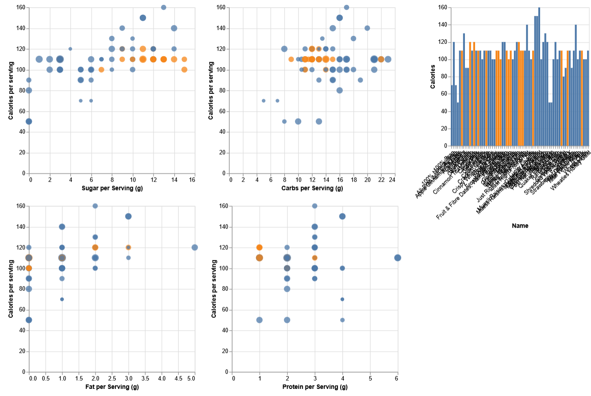
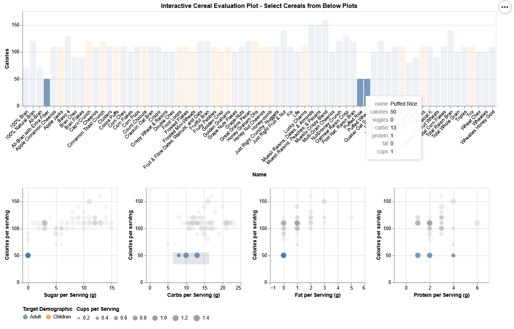

# Cereal Nutrution Interactive Visualization
This interactive visualization was the final project from DTSA5304 - Fundamentals of Data Visualization. The intent of the project was to understand the visualization design process (choice of marks, identifying audience and intent) and the evaluation process (ability to answer questions, find unique insights, identify concerns). Each element of the visualization is justified in the included report, as well as the evaluation reports.

The visualization compared the nutrition of various breakfast cereals. This could be used for parents to identify healthy options for their children, or fitness oriented adults to compare protein to sugar content.

The original visualization WAS quite busy, which was intended because the visualization is interactive. I was curious if the busyness would drive users to engage with the plots and sub-select points without a direct prompt. Notably, none of the evaluation participants interacted with the plot, reflecting the general expectation that plots are not interactive.

An improved version was developed following the course to address the issues identified during original creation and subsequent evaluation.

